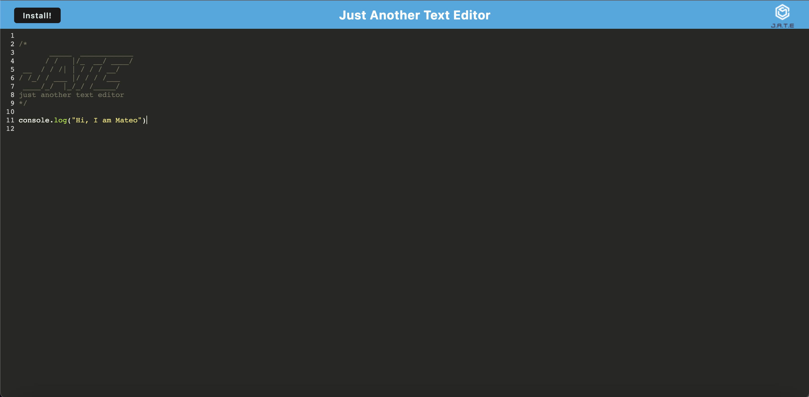

# Text Editor

## Description

Text editor that meets PWA criteria, using data persistence techniques that serve as redundancy in case one of the options is not supported by the browser. Users can create notes or code snippets with or without an internet connection so that they can reliably retrieve them for later use.

Link to the application can be found here: https://guarded-tor-50578.herokuapp.com/

## Table of Contents
- [Visual](#visual)
- [Technologies Used](#technologies-used)
- [Usage](#usage)
- [Code Snippet](#code-snippet)
- [Contributions](#contributions)
- [Questions](#questions)
- [License](#license)

## Visual



## Technologies Used

1. Javascript
2. CSS
3. Node.js
4. IndexedDB
5. Express


## Usage

Open delployed link and type away in your browser. Or click download to add to your local machine and create notes/code snippets from there. 

## Code Snippet

The following logic was used to get all content from the database:

```ruby
export const getDb = async () => {
  const jateDb = await openDB('jate', 1);
  const tx = jateDb.transaction('jate', 'readonly');
  const store = tx.objectStore('jate');
  const request = store.getAll();
  const result = await request;
  console.log('result.value', result.value);
  return result.value;
};
```

## Contributions

Mateo Navarro

Github: https://github.com/mateonav98 

LinkedIn: https://www.linkedin.com/in/mateonav

 ## Questions

For further information or any questions please contact me at mateonav98@gmail.com or https://github.com/mateonav98 

## License

MIT License

Copyright (c) 2022 Mateo Navarro

Permission is hereby granted, free of charge, to any person obtaining a copy of this software and associated documentation files (the "Software"), to deal in the Software without restriction, including without limitation the rights to use, copy, modify, merge, publish, distribute, sublicense, and/or sell copies of the Software, and to permit persons to whom the Software is furnished to do so, subject to the following conditions:

The above copyright notice and this permission notice shall be included in all copies or substantial portions of the Software.

THE SOFTWARE IS PROVIDED "AS IS", WITHOUT WARRANTY OF ANY KIND, EXPRESS OR IMPLIED, INCLUDING BUT NOT LIMITED TO THE WARRANTIES OF MERCHANTABILITY, FITNESS FOR A PARTICULAR PURPOSE AND NONINFRINGEMENT. IN NO EVENT SHALL THE AUTHORS OR COPYRIGHT HOLDERS BE LIABLE FOR ANY CLAIM, DAMAGES OR OTHER LIABILITY, WHETHER IN AN ACTION OF CONTRACT, TORT OR OTHERWISE, ARISING FROM, OUT OF OR IN CONNECTION WITH THE SOFTWARE OR THE USE OR OTHER DEALINGS IN THE SOFTWARE.